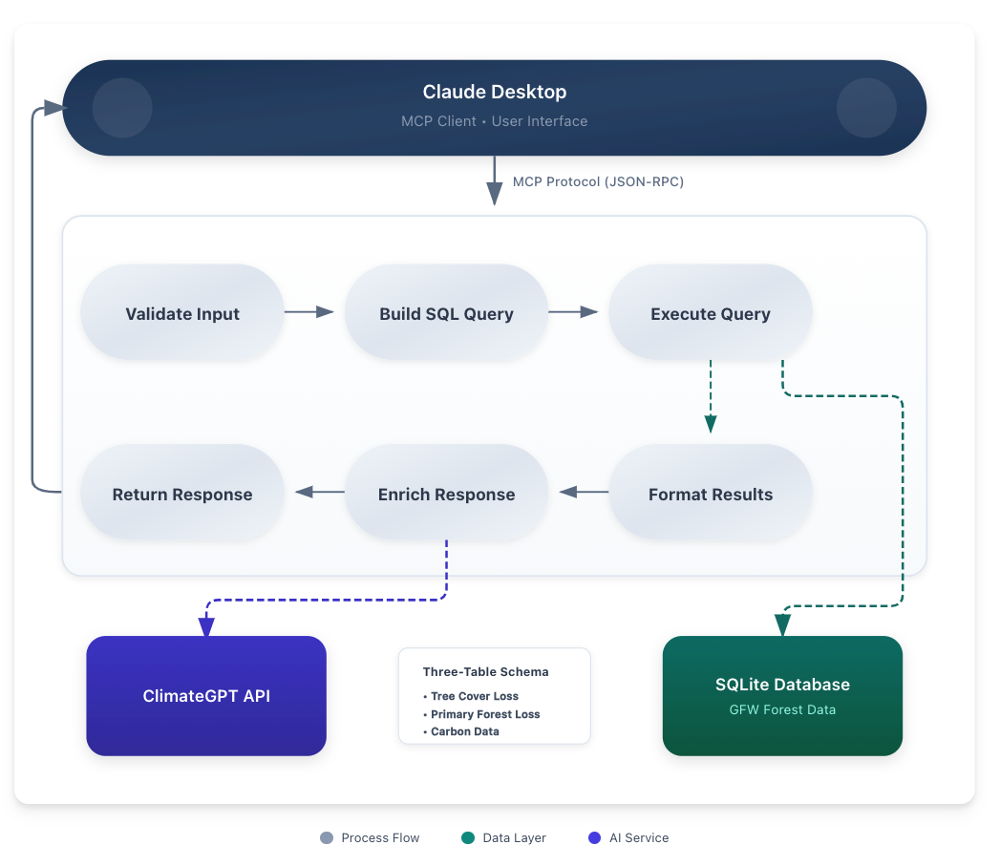

# NexusForest MCP - Architecture Documentation

## System Overview

NexusForest MCP implements a Model Context Protocol (MCP) interface to provide structured access to Global Forest Watch deforestation data. Originally designed as a data bridge to enhance the capabilities of ClimateGPT based on grounded deforestation data, the system transforms raw Excel data into an optimized SQLite database and exposes it through 12 specialized tools accessible via any MCP-compatible client.

## System Architecture Diagram



### Data Flow

1. User queries Claude Desktop
2. Claude selects appropriate MCP tool (from 12 available)
3. Tool function validates parameters and executes parameterized SQL
4. Query runs against SQLite database with indexes
5. Results optionally enhanced with ClimateGPT
6. Response displayed to user

## Architecture Principles

### 1. Three-Table Fact Design

The database uses three separate fact tables instead of a single denormalized table to avoid the sparse matrix problem:

```sql
-- fact_tree_cover_loss (31,680 rows)
-- All countries × All years × 8 thresholds
CREATE TABLE fact_tree_cover_loss (
    country TEXT NOT NULL,
    year INTEGER NOT NULL,
    threshold INTEGER NOT NULL,
    tree_cover_loss_ha REAL,
    PRIMARY KEY (country, year, threshold)
);

-- fact_primary_forest (1,725 rows)
-- Tropical countries only × Years 2002-2024 × Fixed 30% threshold
CREATE TABLE fact_primary_forest (
    country TEXT NOT NULL,
    year INTEGER NOT NULL,
    is_tropical INTEGER DEFAULT 1,
    primary_forest_loss_ha REAL,
    PRIMARY KEY (country, year)
);

-- fact_carbon (11,880 rows)
-- All countries × All years × 3 thresholds (30%, 50%, 75%)
CREATE TABLE fact_carbon (
    country TEXT NOT NULL,
    year INTEGER NOT NULL,
    threshold INTEGER NOT NULL,
    carbon_emissions_mg_co2e REAL,
    PRIMARY KEY (country, year, threshold)
);
```

**Why Three Tables?**
- A single table would be ~60% NULL values
- Separate tables optimize for actual data patterns
- Indexes are more efficient on smaller tables
- Query patterns naturally align with table boundaries

### 2. MCP Server Architecture

```python
# Core server structure (simplified)
class ForestDataMCPServer:
    def __init__(self):
        self.db_manager = DatabaseManager()
        self.metadata_manager = MetadataManager()
        self.tools = self._register_tools()

    async def handle_call_tool(self, name: str, arguments: dict):
        # 1. Tool selection
        tool_handler = self.tools.get(name)

        # 2. Parameter validation
        validated_args = self._validate_parameters(arguments)

        # 3. SQL execution
        results = await tool_handler(validated_args)

        # 4. Response formatting
        return self._format_response(results)
```

### 3. Request Lifecycle

```
1. User Query → MCP Client (Claude Desktop/ClimateGPT)
   ↓
2. Client selects MCP tool based on query intent
   ↓
3. JSON-RPC request via stdio to Docker container
   ↓
4. MCP Server validates parameters using metadata
   ↓
5. Parameterized SQL query executes against SQLite
   ↓
6. ClimateGPT API enhancement 
   ↓
7. Formatted response with source attribution
   ↓
8. Client presents results to user
```

## Component Architecture

### Data Pipeline (ETL)

```python
# Pipeline stages
1. Excel Loading (xlsxfile.py)
   - Parallel sheet reading
   - Memory-efficient chunking

2. Transformation (transformer.py)
   - Country name normalization
   - Threshold mapping
   - Unit conversions (Mg CO2e)

3. Database Export (exporter.py)
   - Batch inserts (10,000 rows)
   - Index creation
   - VACUUM optimization
```

### Metadata Management

The system uses a dual-metadata approach:

**Semantic Metadata** (`config/metadata/semantic.json`):
- Static domain knowledge
- SQL templates
- Query patterns
- Tropical country list

**Runtime Metadata** (`config/metadata/runtime.json`):
- Row counts per table
- Validation status (PASS/FAIL)
- Last pipeline run timestamp
- Data quality indicators


### Security Architecture

```python
# Security layers
1. Input Validation
   - Parameter type checking
   - Range validation
   - Country name verification

2. SQL Injection Prevention
   - Parameterized queries only
   - Table whitelist enforcement
   - No dynamic SQL construction

3. Access Control
   - Read-only database connections
   - Environment-based secrets
   - Docker network isolation
```

## Database Optimization


## Containerization Strategy

### Three-Container Design

```yaml
# docker-compose.yml profiles
pipeline:     # One-time data processing
  - Runs ETL pipeline
  - Creates SQLite database
  - Exits after completion

test:         # Validation suite
  - Runs 49 integration tests
  - Validates data quality
  - Exits with status code

production:   # MCP server
  - Long-running service
  - Handles Claude requests
  - Auto-restarts on failure
```

### Volume Management

```bash
# Persistent data volume
docker volume: processed-data
  └── forest.db (43MB)
      ├── fact_tree_cover_loss
      ├── fact_primary_forest
      ├── fact_carbon
      └── indexes (12)
```


*For tool details, see the [API Documentation](API.md)*